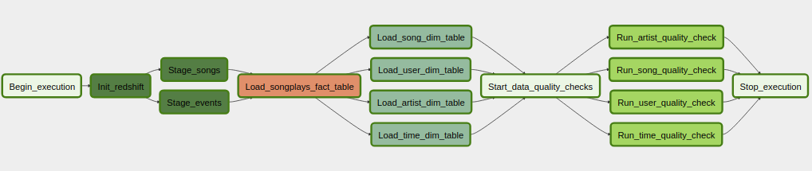

Part 5 of the Udacity Data Engineering Nano-Degree - Data Pipelines with Airflow

# Project Overview

As an employee at a fictional company called Sparkify which operates a music streaming service, 
I must create an etl pipeline to generate data for a star schema in Amazon Redshift using airflow.

Data is stored in s3 as json files.  There are 2 types of data files.

* song files - Contains song metadata
* event/log files - Contains event data from the company associated user actions in the Sparkify app.  
Events contain information on which user plays which songs.

## Architecture

The company has bought into AWS as their cloud provider and want to harness the power of Amazon S3 and Redshift along with Apache Airflow.
This is beneficial since the json files are already in s3.

Redshift will be used as our data store and Apache Airflow will be used to perform etl operations against both s3 and Redshift.

The airflow DAG (directed acyclic graph) performs the following operations
1. Creates all required redshift tables
2. Populates the staging tables from data files in s3
3. Populates the fact and dimension tables from the staging tables
4. Runs some simple data quality checks

Below is an image of the Airflow DAG

## Prequisites

In order to run the code you will need an AWS account, and a fair bit of knowledge about setting up the resources that are used in AWS.

1. docker and docker-compose installed.  Alternatively you can install airflow on your local desktop and copy the files where they need to go.
2. Access to input s3 files
3. Redshift cluster created with correct permissions and security groups.
4. AWS access key and secret to account used for creating redshift

## Running the code

1. git clone this repo and cd into it
2. docker-compose up  (Or start Airflow on your desktop) NOTE - There will be errors in the logs until you create the required connections and variable in the UI
3. Open Airflow UI at http://localhost:8080
4. In Airflow UI - Create Amazon Web Services connection with conn_id `aws_credentials`
5. In Airflow UI - Create Postgres connection for Redshift with conn_id `redshift`
6. In Airflow UI - Create a variable named `udac_dend_config` and copy paste content of udac_dend_config_example.json
7. You should now see a single DAG call udac_dend_dag which you can run manually

